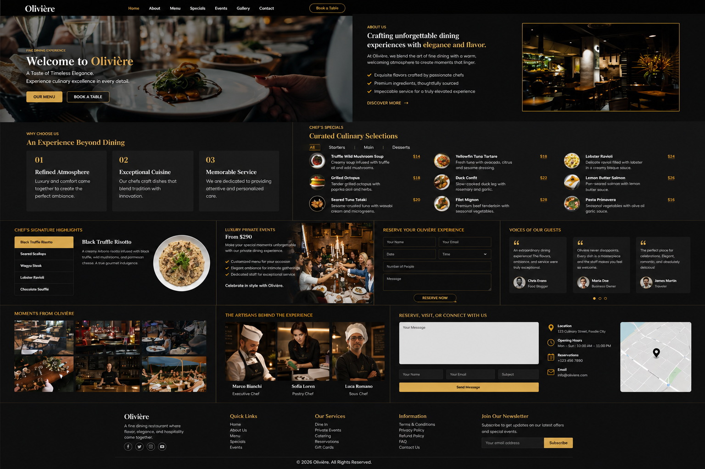

# 🍽️ Olivière

### Premium Restaurant & Fine Dining Website

<p align="center">
  
</p>

<p align="center">
A modern, elegant restaurant website crafted to deliver a premium dining experience through refined design, responsive layouts, and interactive user experiences.
</p>

<p align="center">
  <a href="https://YOUR-LIVE-DEMO.com">🌐 Live Demo</a>
  &nbsp;•&nbsp;
  <a href="https://github.com/absshoyeb/OLIVIERE">📂 Source Code</a>
  &nbsp;•&nbsp;
  <a href="https://absshoyeb.com">👨‍💻 Portfolio</a>
</p>

---

## 📖 Overview

Olivière is a premium restaurant website designed to showcase a fine dining experience with an elegant and modern interface. The project combines responsive design, engaging animations, interactive menus, online reservations, and seamless user navigation to create a professional restaurant presence.

Built as part of my frontend portfolio, the project also includes PHP-powered contact, reservation, and newsletter forms, making it suitable for further backend expansion.

---

## ✨ Features

- 🍽️ Elegant restaurant landing page
- 📱 Fully responsive design
- 🏠 Hero section
- 👨‍🍳 About the restaurant
- ⭐ Why Choose Us section
- 📖 Interactive food menu
- 🍷 Chef's Specials
- 🎉 Events slider
- 📅 Online table reservation
- 💬 Customer testimonials
- 📸 Lightbox gallery
- 👨‍🍳 Professional chefs showcase
- 📍 Google Maps integration
- 📞 Contact form
- 📧 Newsletter subscription
- 🔝 Scroll-to-top button
- 🎨 Smooth animations
- ⚡ Optimized user experience

---

## 🍴 Website Sections

- Home
- About
- Why Us
- Menu
- Specials
- Events
- Book a Table
- Testimonials
- Gallery
- Chefs
- Contact
- Newsletter
- Footer

---

## 🛠️ Tech Stack

| Category | Technologies |
|----------|--------------|
| Frontend | HTML5, CSS3, JavaScript (ES6) |
| Backend | PHP |
| Framework | Bootstrap 5 |
| Libraries | AOS, Swiper.js, GLightbox, Isotope.js |
| Icons | Bootstrap Icons |
| Fonts | Google Fonts |
| Layout | Flexbox, CSS Grid, CSS Variables |

---

## ⚙️ JavaScript Functionality

The project includes several interactive frontend features:

- Responsive mobile navigation
- Sticky header
- Active navigation highlighting
- Smooth scrolling
- Scroll-to-top button
- Preloader animation
- Hero animations
- AOS scroll animations
- Swiper sliders
- Isotope menu filtering
- GLightbox gallery
- Responsive mobile menu
- URL hash scrolling
- Optimized scroll performance

---

## 🐘 PHP Functionality

The website includes PHP-powered forms using the **PHP Email Form** library.

### Contact Form

- AJAX submission
- Name, Email, Subject & Message
- Optional SMTP support

### Table Reservation

- Customer details
- Reservation date & time
- Number of guests
- Reservation message
- AJAX submission

### Newsletter

- Email subscription
- AJAX submission
- Optional SMTP support

> **Note:** Before deploying, replace the default `contact@example.com` email address with your own receiving email or configure SMTP credentials.

---

## 📱 Responsive Design

Optimized for:

- 🖥️ Desktop
- 💻 Laptop
- 📱 Tablet
- 📲 Mobile
- 📳 Small Mobile Devices

Responsive improvements include:

- Desktop navigation
- Full-screen mobile navigation
- Responsive hero section
- Adaptive typography
- Responsive menu tabs
- Mobile reservation form
- Responsive contact section
- Flexible layouts
- Optimized spacing

---

## 📂 Project Structure

```text
OLIVIERE/
│
├── assets/
│   ├── css/
│   ├── js/
│   ├── img/
│   └── vendor/
│
├── forms/
│   ├── contact.php
│   ├── book-a-table.php
│   └── newsletter.php
│
├── preview.png
├── index.html
└── README.md
```

---

## 🚀 Getting Started

### Clone the repository

```bash
git clone https://github.com/absshoyeb/OLIVIERE.git
```

### Navigate to the project

```bash
cd OLIVIERE
```

### Run the project

Open **index.html** in your browser.

For local PHP functionality, run the project through a local server such as:

- XAMPP
- WAMP
- Laragon
- Local by Flywheel
- VS Code PHP Server

---

## 📌 Project Status

Olivière is a responsive restaurant website featuring both frontend and PHP-powered form functionality.

The contact, reservation, and newsletter forms are fully integrated with the PHP Email Form library and are ready for deployment after configuring a valid receiving email address or SMTP credentials.

---

## 🚀 Future Enhancements

- Restaurant CMS
- Online food ordering
- Customer accounts
- Reservation dashboard
- Admin dashboard
- Live table availability
- Payment gateway integration
- Email notifications
- Multi-language support
- Dark mode
- Progressive Web App (PWA)
- SEO optimization
- Performance improvements
- Accessibility enhancements

---

## 👨‍💻 Author

**Abu Bakar Siddik Shoyeb**

Frontend Developer passionate about building modern, responsive, and user-friendly web experiences.

🌐 **Portfolio**  
https://absshoyeb.com

💼 **LinkedIn**  
https://www.linkedin.com/in/absshoyeb/

💼 **GitHub**  
https://github.com/absshoyeb

📧 **Email**  
info.absshoyeb@gmail.com

---

## ⭐ Support

If you enjoyed this project or found it useful, consider giving the repository a ⭐ on GitHub.

---

## 📄 License

This project was created for educational and portfolio purposes.

© 2026 Abu Bakar Siddik Shoyeb. All rights reserved.
